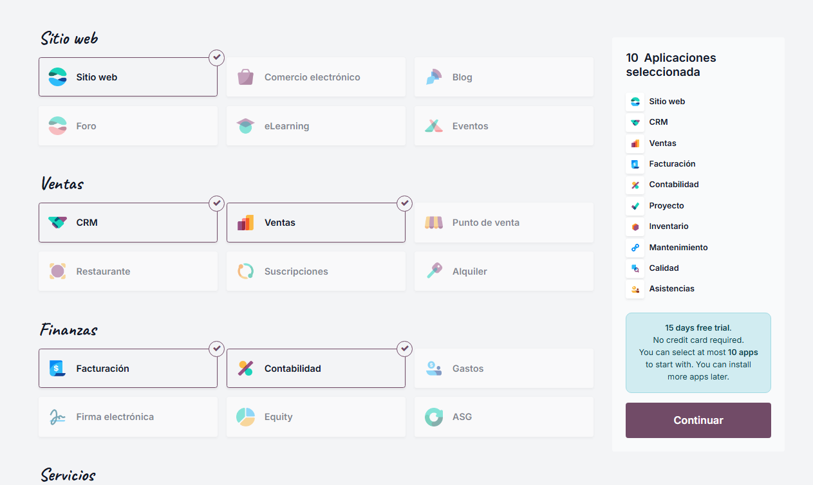
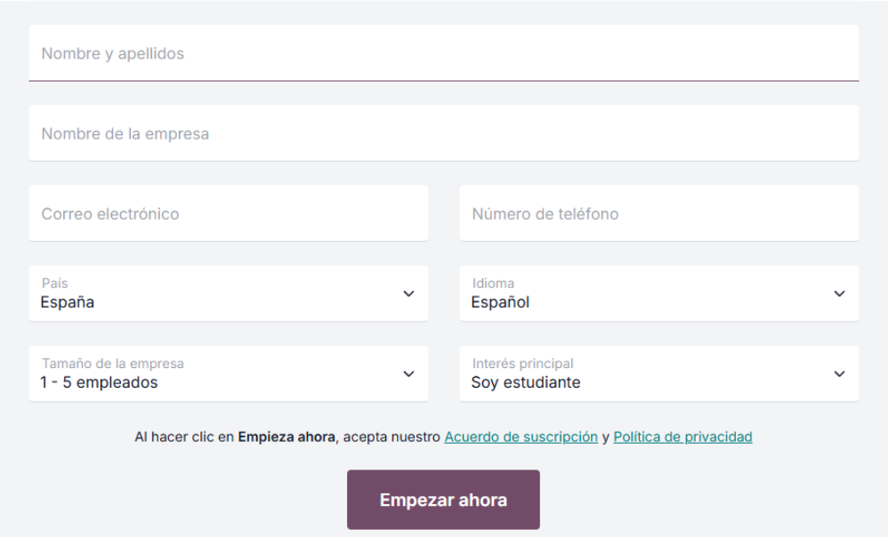
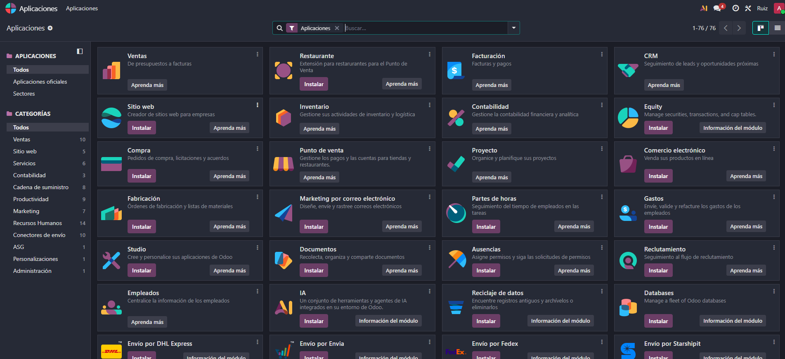

# 03 — Instalación y prueba (15 días) / Alta e instalación de apps

> Estructura orientativa

## Requisitos previos

- Navegador actualizado.
- Cuenta de correo para alta.

## Pasos

1. **Crear base de datos de prueba (15 días)** desde odoo.com (activar por email).

   

Aqui nos pedira seleccionar el plan de Odoo, como dije hay dos tipos la Community y la Enterprise (estandar y personalizado), nosotros para este caso elegiremos el plan estandar ya que vamos a utilizar la prueba gratis de 15 dias que nos dan.

1. **Seleccionar apps iniciales** (máximo 10 en la prueba): CRM, Ventas, Facturación, Contabilidad, Proyectos, Documentos, Calendario, etc.

   

   Una vez seleccionado el plan nos deja elegir 10 modulos en la prueba gratuita,  nosotros hemos elegido los que se ven en la derecha.

Aqui nos pedira nuestros datos antes de empezar.

1. **Instalar/Desinstalar apps** desde *Aplicaciones* (¡cuidado con los datos al desinstalar!).
   

Una vez hayamos iniciado la prueba gratuita o hayamos pagamos la membresia se nos abrira esto, previo a hacer nada nos enviaran un correo de activacion de nuestra base de datos.

Ahi le daremos a aplicaciones y se abrira esta imagen, aqui podremos instalar o desinstalar aplicaciones.

Para instalar valdria con darle al boton de instalar, para desinstalar una aplicacion deberiamos darle a los 3 puntitos que hay a la izquierda de la aplicacion y en el menu que nos salee nos da la opcion de esinstalar.
