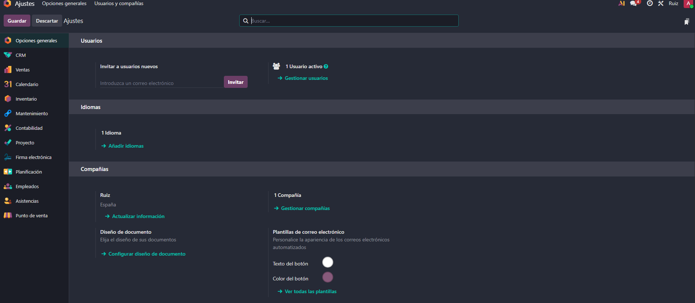
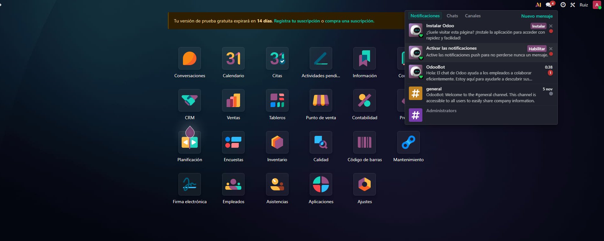
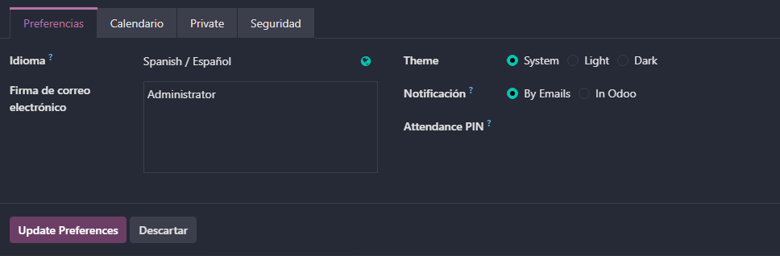
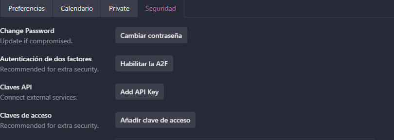
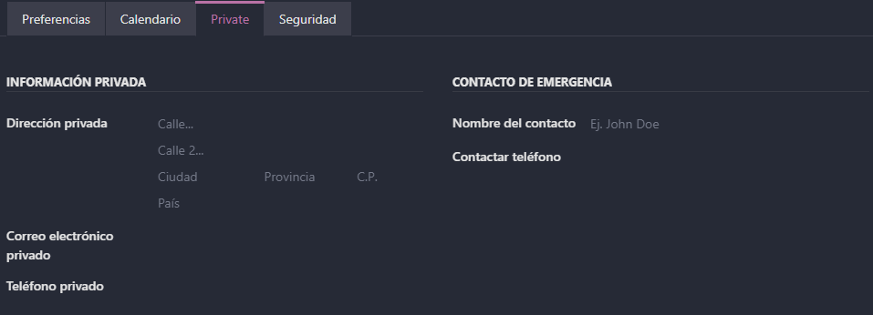
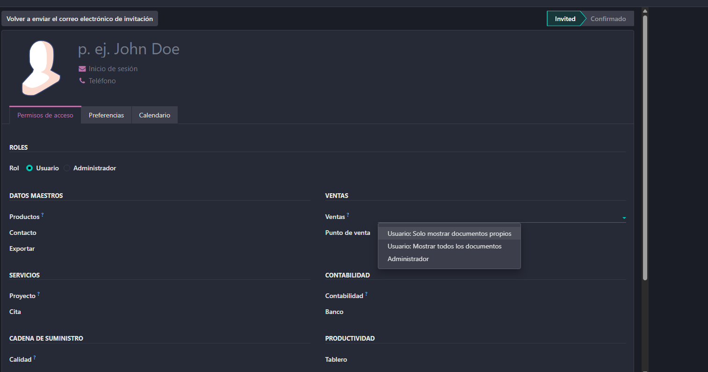
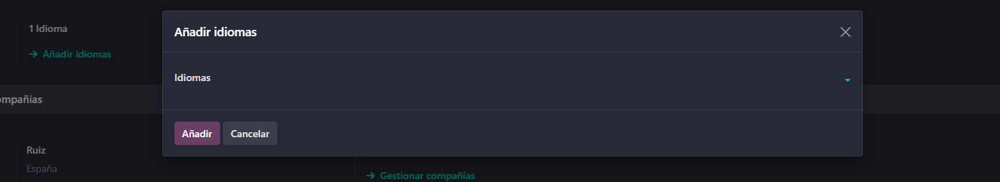
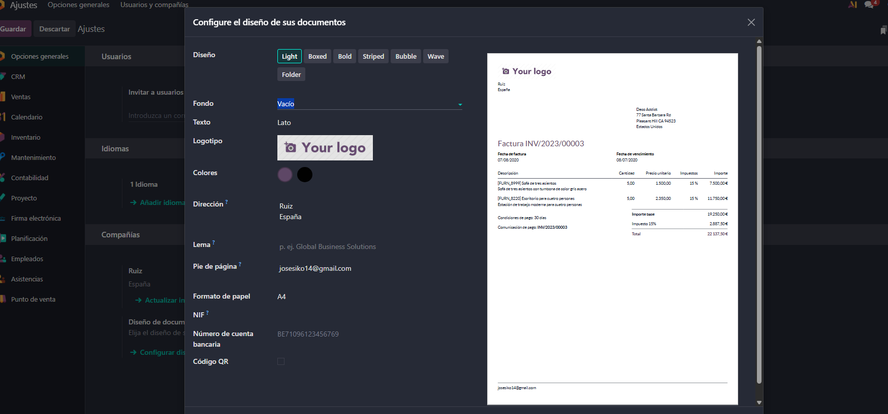
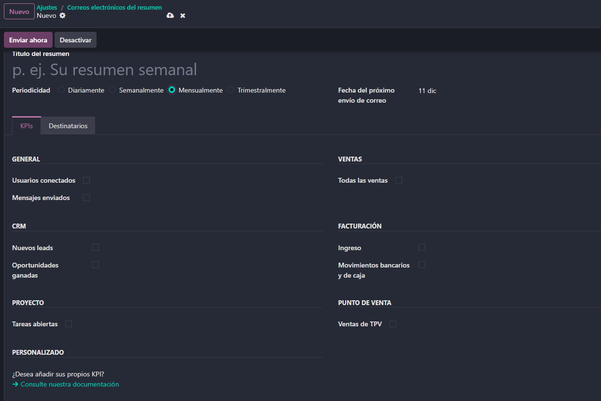

# 04 — Ajustes generales

Aqui vemos una vista general de los ajustes donde podemos ver una zona de opciones generales y ajustes especificos de cada aplicacion instalada.

- Activar **notificaciones** y (opcional) **PWA**.

Antes de empezar siempre es bueno tener las notificaciones acctivadas por si pasa algo cuando no estamos viendo.

* Perfil: modo oscuro, datos, **2FA**, firma email, notificaciones en Odoo.

Dentro de nuestro perfil en el aprtado de preferencias podremos activar el modo oscuro, la forma en que  nos llegan las notificaciones y modificar la firma de correo electronico.

Tambien en la pestaña de seguridad podremos activas la verificacion en dos pasos cambiar copntraseñas, añadir claves de accesp y ademas tenemps los logs a nuestro Odoo de forma rapida.

En la pestaña Private tendremos acceso a nuestros datos personales.

- **Usuarios y compañías**: roles por módulo; en Enterprise se paga por usuario.

Aqui podriamos añadir usuarios a nuestra compañia segun en que modulo estaria activo este usuario podemos darle mas o menos permisos, al añadir nos salen las aplicaciones que tenemos instaladas en nuestro Odoo y nos deja elegir en cuales darle acceso y permisos y en cuales no.

Aqui nos dejaria crear nuevas compañias.

* **Idiomas** y **diseño de documentos** (plantillas de factura).

En esta pestaña nos dejaria añadir idiomas para cambiar el idioma de nuestro Odoo

Mas abajo nos dejaria configurar el diseño de nuestros documentos como las facturas.

- **Emails de resumen**: periodicidad y destinatarios.

Aqui nos dejaria configurar correos automaticos nos dejaria cambiar cada cuanto tiempo mandarlos y a quien mandarlos.
