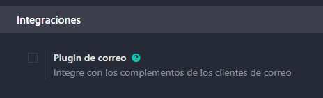
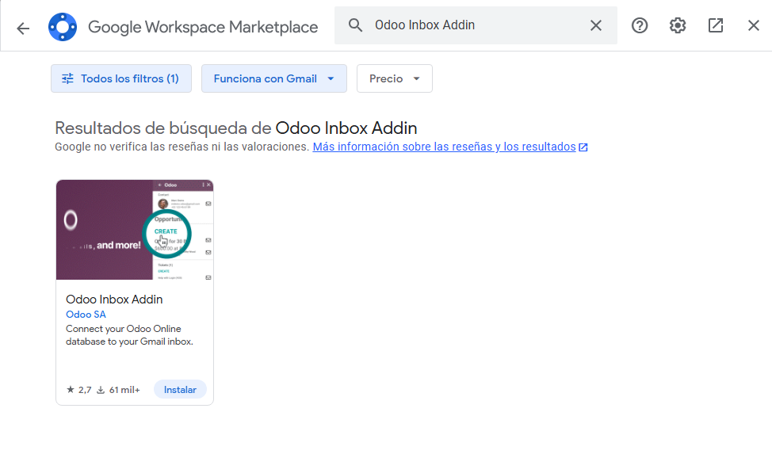
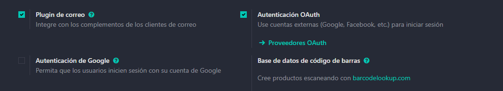
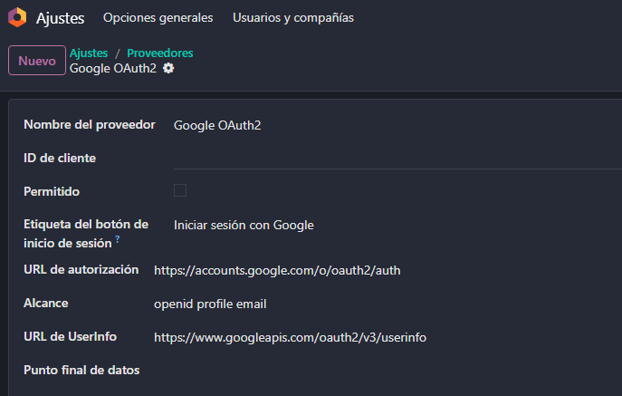
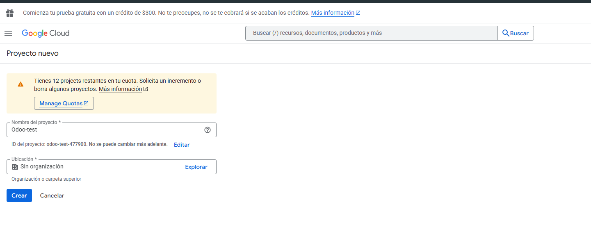
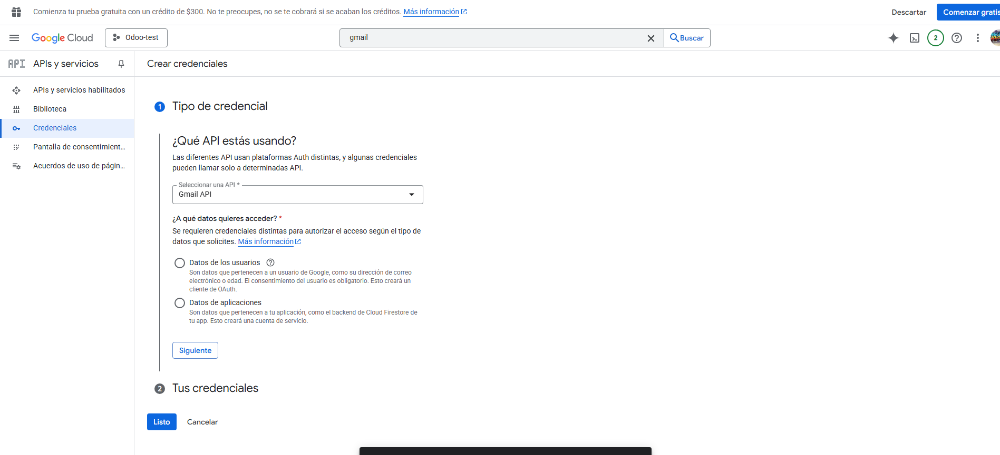
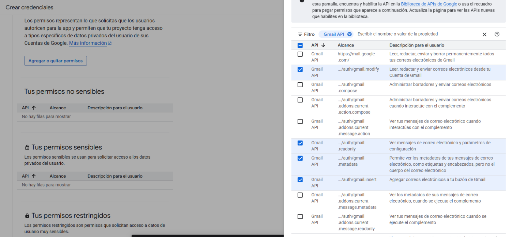
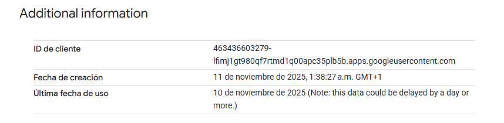
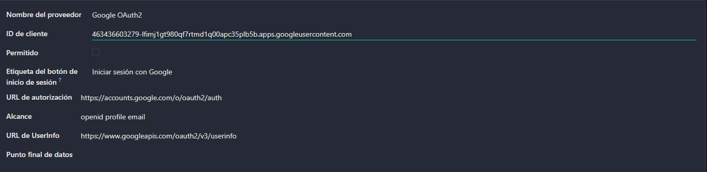
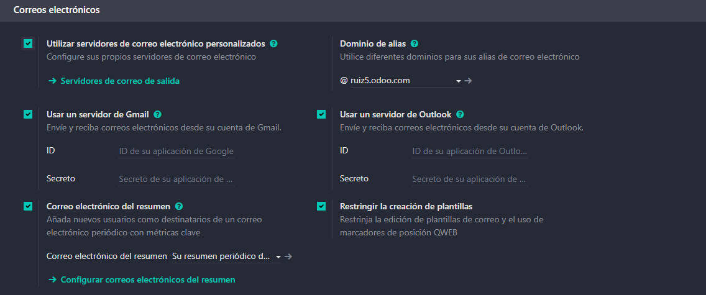

# 05 — Integración con Gmail (OAuth GCP + Add-on)

## Requisitos

- Cuenta Google Cloud (GCP).

## Pasos resumidos

* **Activar plugin de correo** en Odoo e instalar *Odoo Inbox Add-on* en Gmail.
  
  Antes de empezar deberiamos activar el plugin de correo situado en ajustes dentro de opciones generales.

Despues debemos ir a nuestro correo y descargar Odoo Inbox Addin

* En **Google Cloud Console**: habilitar *Gmail API*, crear **OAuth Client (Web)**, configurar **redirect URI** de Odoo

Primero debemos activar la Autenticacion OAuth.

Debemos ir ahi y darle donde pone google OAuth2.

Una vez hecho eso nos vamos a la consola de google y creamos un nuevo proyecto.

Dentro del proyecto habilitamos Gmail API.

Le daremos a crear credenciales y rellenaremos la informacion que nos pide.

En la opcion de seguridad marcaremos las opciones que queramos que tenga acceso y añadiremos en el id de cliente OAtuth una URI de redireccionamiento autorizada, en este caso seria asi https:/nombre.odoo.com/google_gmail/confirm donde nombre sera tu nombre de odoo.

Todo esto nos dara esta informacion que usaremos ahora desde Odoo.

Copiariamos el id cliente y le dariamos a guardar.

Ahora activariamos la opcion de utilizar servidores de correo personalizados y nos apareceria la opcion de usar un servidor de gmail donde pondriamos el id de cliente y el secreto de el API de gmail que hemos creamo antes.
