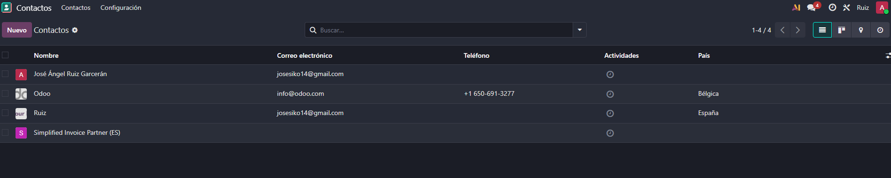
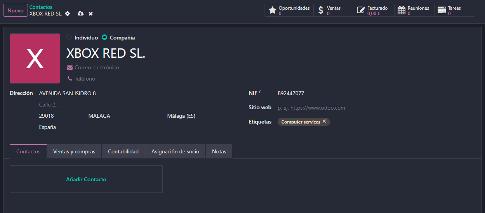
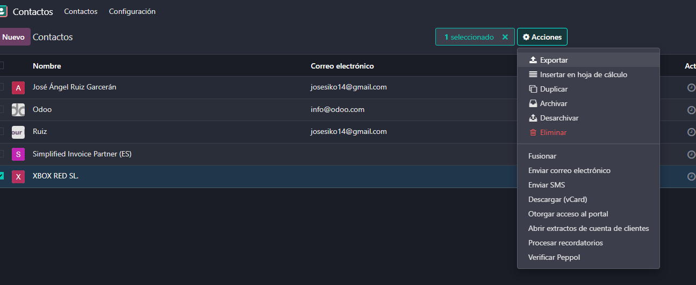
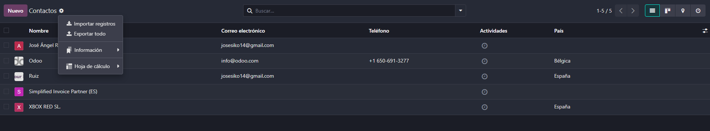
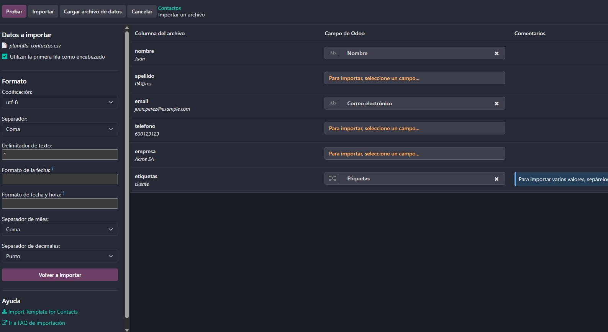

# 06 — Contactos

- Asociación automática persona/empresa.
  

Aqui estaria nuestra lista de contactos , entrariamos aqui desde la pantalla de inicio y dandole al modulo de contactos

Podemos crear contactos ya sean de compañias o personas fisicas, nos da la informacion del contacto y arriba un breve resumen del contacto.

Para exportar un contaco somplemente habria que selecionarlo y darle al boton de acciones, ahi nos sale directamente para importar aparte de otras acciones.

Para exportar seria darle al simbolo del engranaje al lado de conntactos para que saliese un menu donde podriamos importa directamente.

Al querer importar nos dejara elegir el archivo y nos saldra este manu donde podremos modificar algunos parammetros.

Podemos crear etiquetas para asi poder filtrar mejor los contactos que tenemos.
