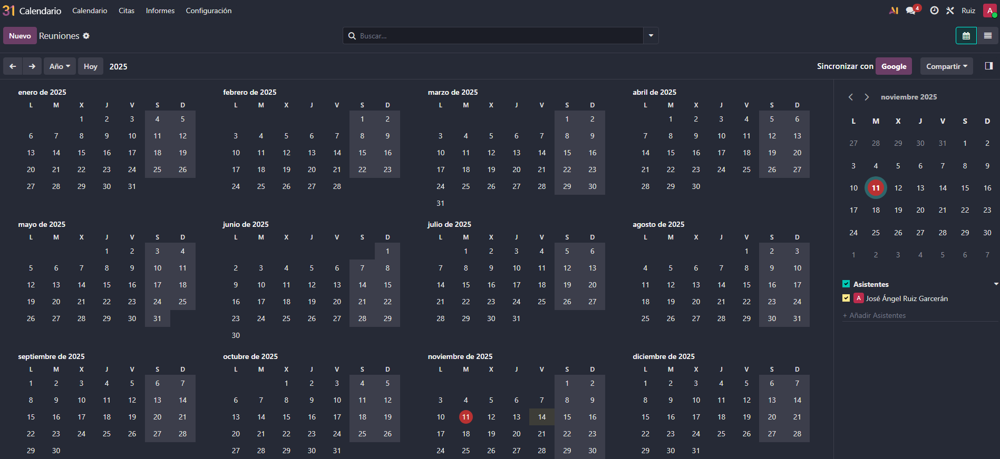
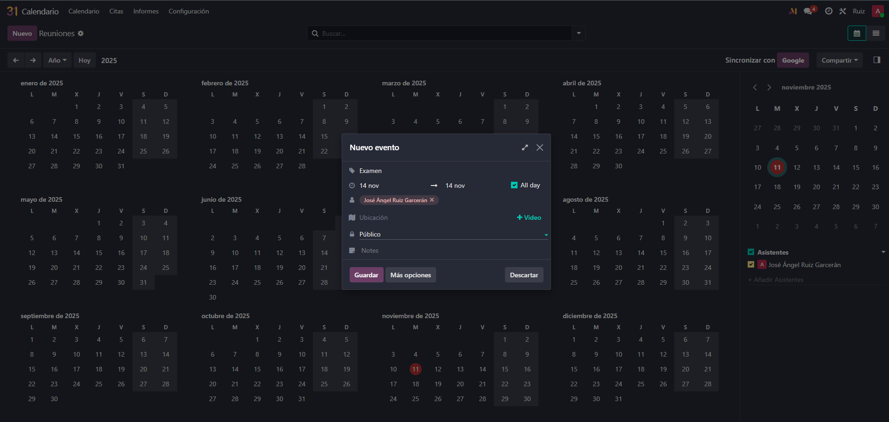
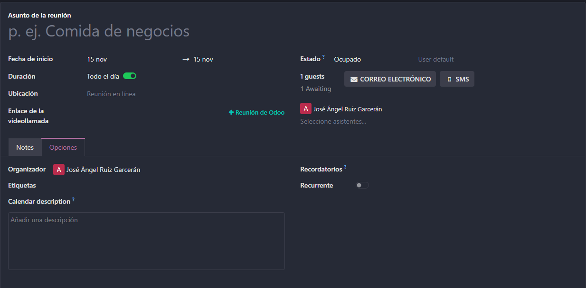
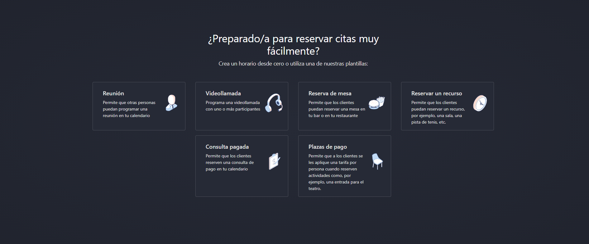

# 07 — Calendario y Citas

- Calendario (día/semana/mes) + disponibilidad del equipo.
  

Aqui estaria nuestro calendario dentro de Odoo, aqui podriamos crear eventos para que la gente que esta conectada a nuestra base de datos pueda ver futuros eventos o la disponibilidad del grupo.

Asi seria la cracion de eventos.

Esto nos saldria al darle a mas opciones como podemos ver tenemos la opcion de marcar la disponibilidad al crear el evento para que se sepa si estamos disponibles para consultas o cualquier cosa, tambien se podria poner un url de una llamada para asi poder ir directamente a una reunion de forma telemaica, al darle directamente a reunion de Odoo nnos mandaria a un meet desde Odoo directamente.

* Citas

Aqui entrariamos en el modulo de citas donde podriamos crear directanmente reuniones o hacer reservaciones de mesa para que el equipo sepa lo que se va a hacer.
