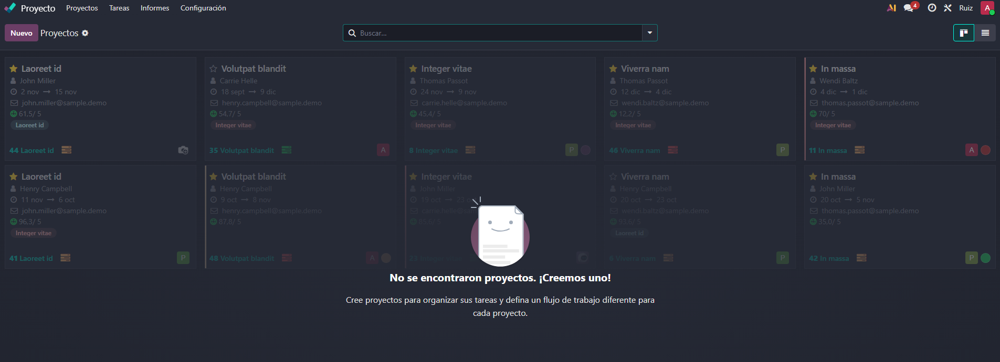
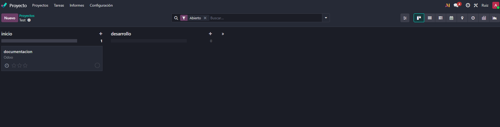
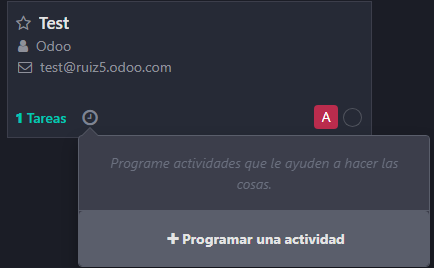
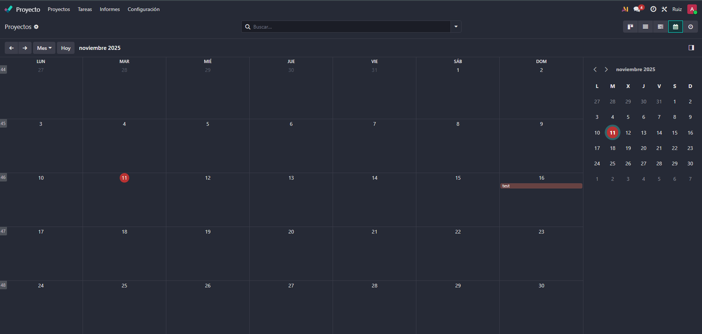

# 08 — Proyectos (Kanban)

- Proyectos, etapas, tareas, **subtareas**.
  

Esto seria lo que nos sale al entrar por primera vez a la pestaña de proyectos.

Al crear el proyecto podremos asignar cliientes directamente para hacer el calculo de la facturacion y llevar al numero de horas dedicadas.

Aqui tenemos las etapas del proyecto donde a cada etapa se asignaran diferentes tareas.

Desde la imagen del proyecto podemos crear tareas directamente.

- Vistas: tarjetas, lista, calendario propio.

Tenemos un calendario para cad proyecto donde lnos indoca que tareas van a finalizar.
