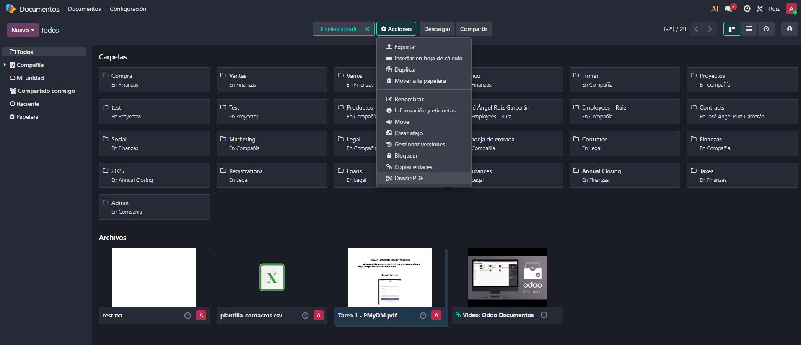
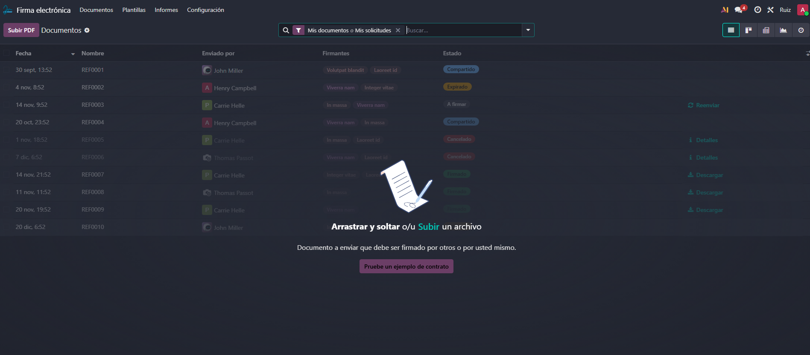
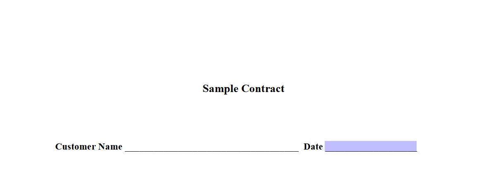
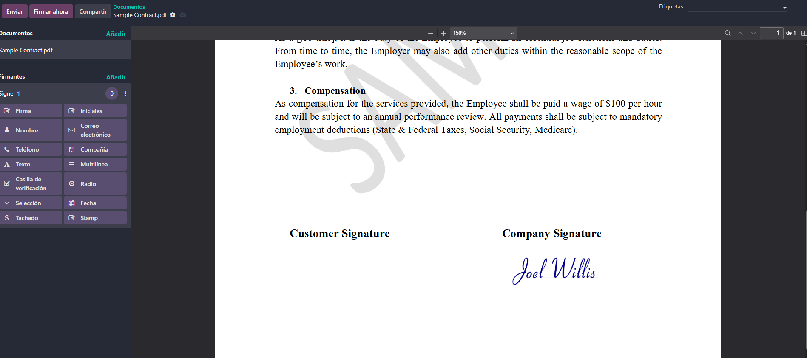
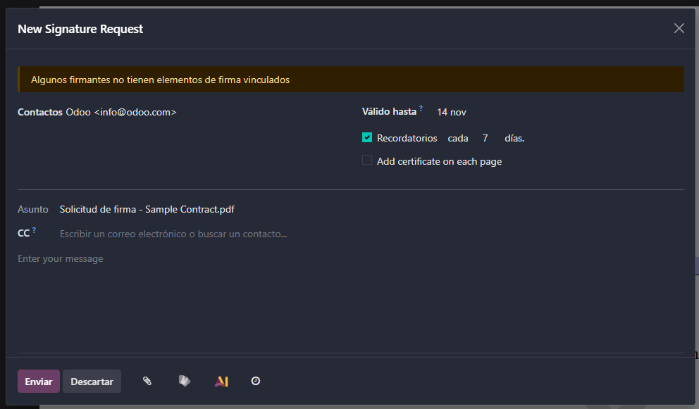
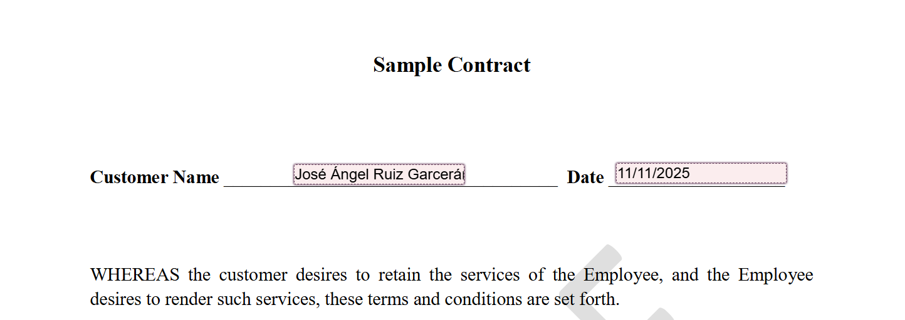
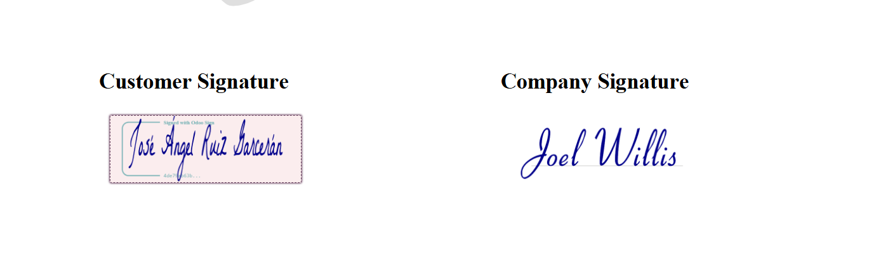
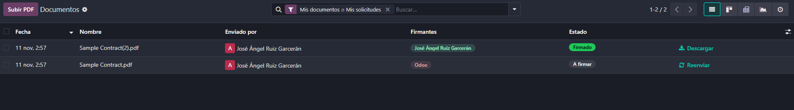
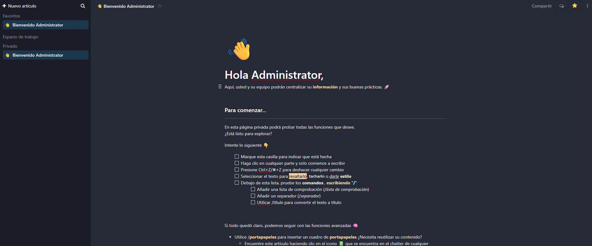

# 09 — Documentos, Firma e Información (Knowledge)

- **Documentos**: repositorio, dividir PDFs, etiquetas/flujo.

Aqui tenemos el modulo de documentos donde podemos subir nuestros documentos, tambien en la zona de proyectos tenemos los documentos asociados a nuestros proyectos.

Nos da la opcion de dividir nuestros pdf por si solo necesitamos la informacion de una parte del archivo, tambien dandole a informacion y etiquetas podriamos añadirle etiquetas para asi poder organzarlo mejor.

- **Firma electrónica**: campos (firma/nombre/fecha), envío y registro.

Aqui teendriamos nuestro modulo de firma electronica, donde podriamos firmar documentos sin la necesidad de tener que fotocopiarlos y luego resubirlos.

Aqui tenemos una hoja de ejemplo para ver las funcionabilidades del modulo donde se podri aponer nuestro nombre, la fecha en la que se esta editando el archivo y la firma.

Aqui podriamos enviarle el documento a algun cliente o persona de nuestros contactos para que lo firmase.

Aqui ya estaria firmado con el nombre y la firma puesta.

Y se quedaria un registro de nuestros documentos firmados.

- **Información (Knowledge)**: wiki tipo Notion, permisos y publicación.

Este seria nuestro modulo de información para crear uno nuevo deberiamos ir a espacio de trabajo y ahi podriamos crear nuevosarticulos, una vez hecho lo podemos compartir clicando arriba a la derecha e invitar a quien queramos para que pueda verlo y edittarlo si le damos permisos para ello.
