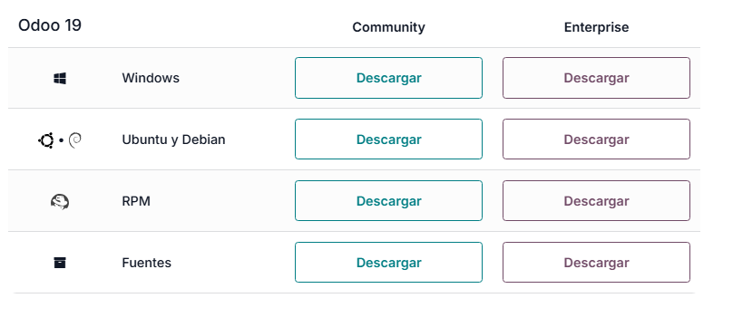
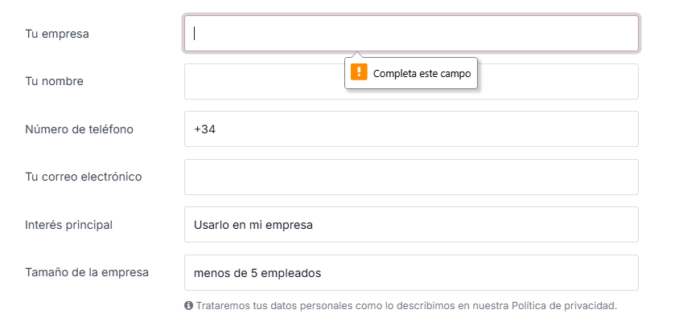

# 03 — Descarga del instalador de Odoo

1. Accede a la **web oficial de Odoo** y localiza el **instalador para Windows**.
   Accedemos a la web oficial de Odoo, ahi iremos a la version que queremos instalar, en nuestro caso Odoo 19 community, nos pedira rellenar un formulario para poder tener el .exe.

[https://www.odoo.com/es_ES/page/download](https://www.odoo.com/es_ES/page/download)

Descarga la **versión estable** que vayas a usar en clase (anota la **versión exacta**).

Nos daria este archivo ejecutable para instalar Odoo.
`odoo_setup_19.0.20251111.exe`
