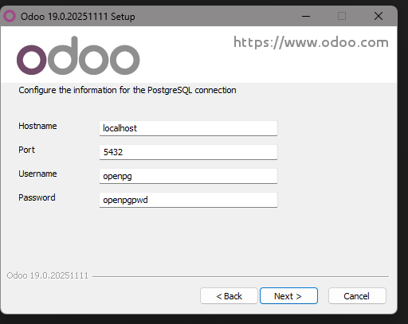

# 04 — PostgreSQL en Windows

* Verifica si el instalador de Odoo **instala PostgreSQL** automáticamente.
  Como podemos ver nos instalaria directamente PostgreSQL
  

Aqui configuramos el host, puerto y el usuario y contraseña de PostgreSQL
