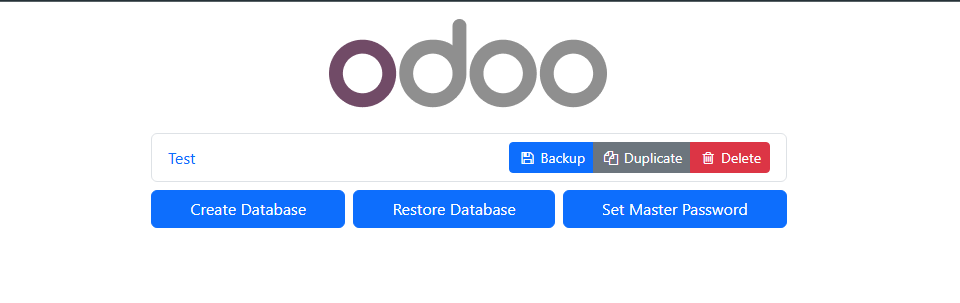
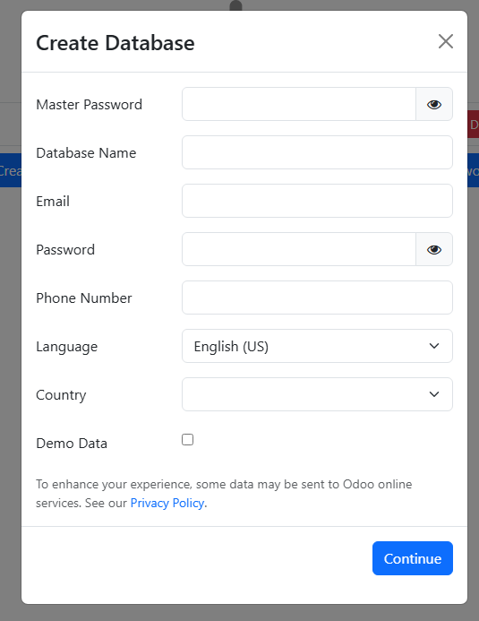
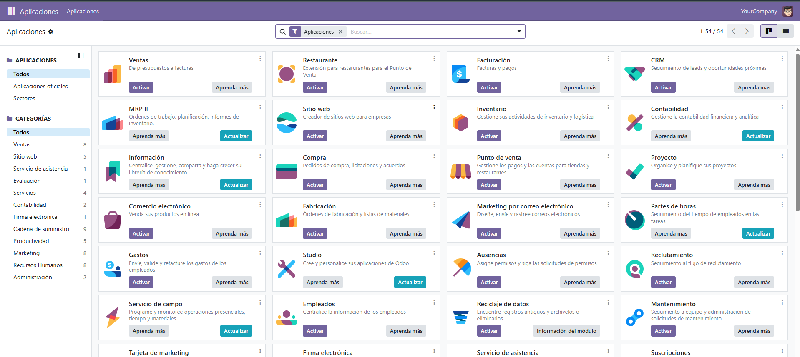

# 08 — Creación de base de datos de prueba

* Accede a `http://localhost:8069` en tu navegador.

Nos pide crear una base de datos nada mas entramos por primera vez a http://localhost:8069.

En caso de que queramos otra base de datos debemos ir a esta url http://localhost:8069/web/database/manager aqui nos saldran las base de datos ya creadas y nos dejara crear mas.

Al darle a crear nos saldra el siguente formulario.

Cuando la hayamos creado podremos seleccionar los modulos que queramos.
