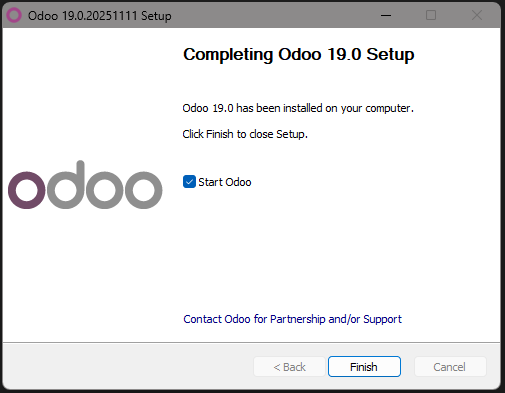
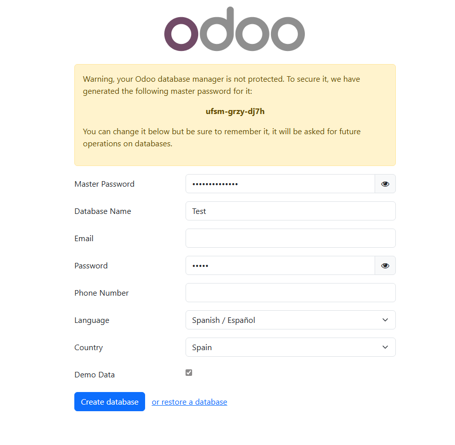

# 05 — Instalación de Odoo

* Ejecuta el instalador (`.exe`) como **Administrador**.

Una vez ejecutanmos el instalador y marcamos la direccion donde se va a instalar nos saldra esta pantalla.(Instalacion tipica de cualquier aplicacion despues de indicar la configuracion de postgreSQL.)

Una ez rellenado el formulario nos da a elegir el modulo que queramos.
