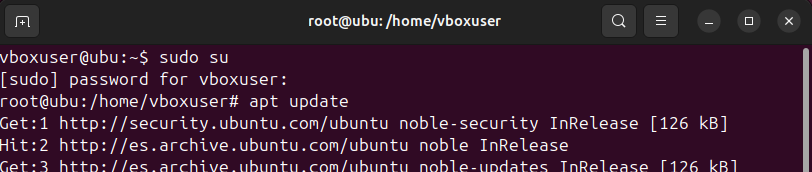
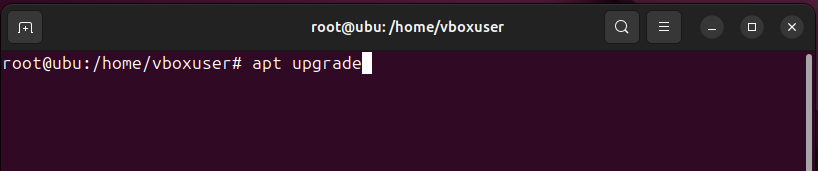

# 03 — Preparación del sistema

* Actualiza índices y paquetes:
  
  Empezamos utilizando un sudo su para entrar en el modo administrador, y luego haremos un update

  

Despues continuaremos haciendo un upgrade.

Para configurar la zona horaria se utilizara este comando:

timedatectl set-timezone "Zona Horaria"
