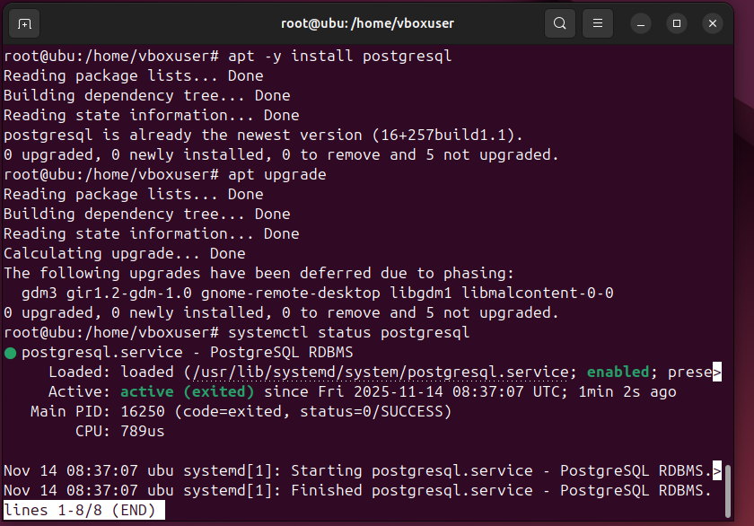

# 04 — PostgreSQL en Linux

* Instala PostgreSQL desde repos:

  ```bash
  sudo apt -y install postgresql
  ```

  ```bash
  sudo systemctl status postgresql
  ```




Una vez puesto el primer comando dejaremos que se instale y despues verificaremos el estado del servicio con el segundo comando.
