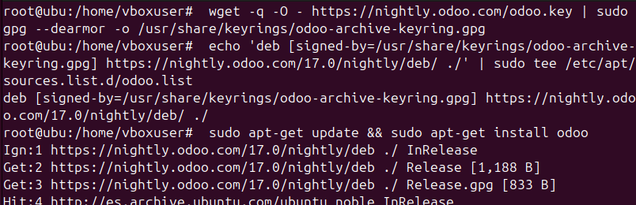

# 06 — Instalación de Odoo

Enlace fuente: https://www.odoo.com/documentation/17.0/es/administration/on_premise/packages.html

* Clona código y crea entorno virtual:
  ```bash
  sudo -u odoo -H bash -c 'git clone https://github.com/odoo/odoo.git /opt/odoo/odoo-src -b <version>'
  sudo -u odoo -H bash -c 'python3 -m venv /opt/odoo/venv && /opt/odoo/venv/bin/pip install -U pip wheel'
  sudo -u odoo -H bash -c '/opt/odoo/venv/bin/pip install -r /opt/odoo/odoo-src/requirements.txt'
  ```
