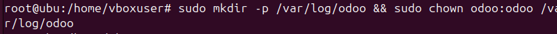

# 07 — Configuración de Odoo (`/etc/odoo/odoo.conf`)

* Primero creamos el archivo de consiguracion.

```
  sudo nano /etc/odoo/odoo.conf
```

* Crea/edita el archivo de configuración con:

  ```ini
  [options]
  db_host = False
  db_port = False
  db_user = odoo
  db_password = False
  addons_path = /opt/odoo/odoo-src/addons
  logfile = /var/log/odoo/odoo.log
  xmlrpc_port = 8069
  ```

  
* Crea carpetas y permisos si procede:

  ```bash
  sudo mkdir -p /var/log/odoo && sudo chown odoo:odoo /var/log/odoo
  ```


