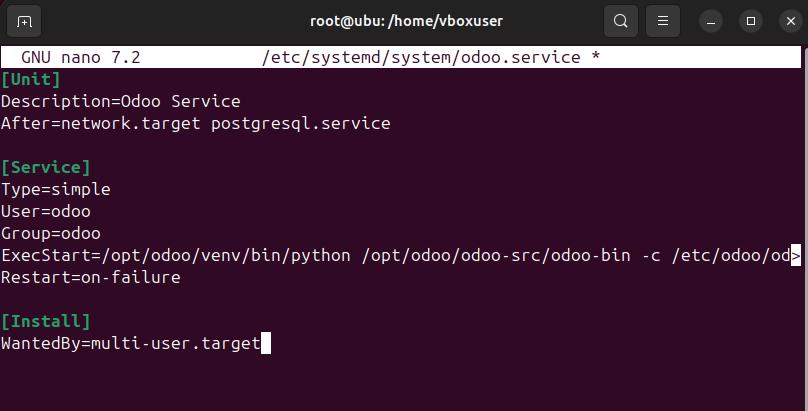
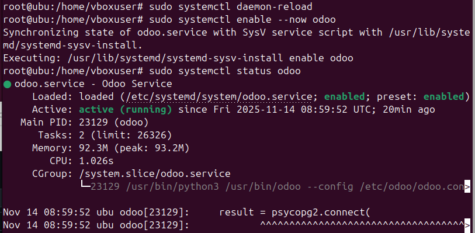

# 08 — Servicio systemd (`odoo.service`)

* Crea el servicio en `/etc/systemd/system/odoo.service`:
  ```ini
  [Unit]
  Description=Odoo Service
  After=network.target postgresql.service

  [Service]
  Type=simple
  User=odoo
  Group=odoo
  ExecStart=/opt/odoo/venv/bin/python /opt/odoo/odoo-src/odoo-bin -c /etc/odoo/odoo.conf
  Restart=on-failure

  [Install]
  WantedBy=multi-user.target

  ```



* Recarga y arranca:
  ```bash
  sudo systemctl daemon-reload
  sudo systemctl enable --now odoo
  sudo systemctl status odoo
  ```


